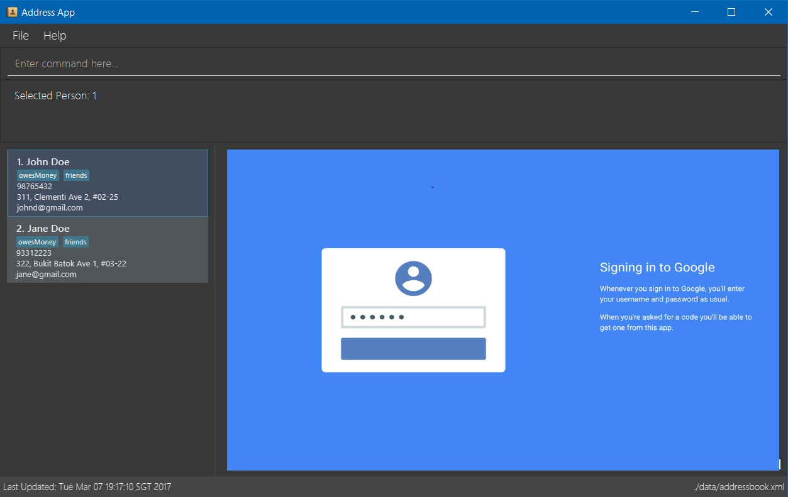

= Contact'em
ifdef::env-github,env-browser[:relfileprefix: docs/]
ifdef::env-github,env-browser[:outfilesuffix: .adoc]

https://travis-ci.org/CS2103AUG2017-T11-B4/main[image:https://travis-ci.org/se-edu/addressbook-level4.svg?branch=master[Build Status]]
https://coveralls.io/github/CS2103AUG2017-T11-B4/main?branch=master[image:https://coveralls.io/repos/github/se-edu/addressbook-level4/badge.svg?branch=master[Coverage Status]]

ifdef::env-github[]

endif::[]

ifndef::env-github[]
image::images/Ui.png[width="600"]
endif::[]

Have you ever felt that the address book applications you usually use, such as that in your phone, are simply
not good enough to help you properly manage your contacts? Then this application is perfect for you!

Contact'em is a desktop address book application, and the user interacts with it through typing commands
into the application.

* Some features of Contact'em include:
** Being able to search for contacts by their tags
** A convenient and easy-to-use Find functionality
** Sync with Google Contacts

== Site Map

* <<UserGuide#, User Guide>>
* <<DeveloperGuide#, Developer Guide>>
* <<AboutUs#, About Us>>
* <<ContactUs#, Contact Us>>

== Acknowledgements
* The original source code was from the AddressBook-Level4 project created by SE-EDU initiative at https://github.com/se-edu/
* Some parts of this sample application were inspired by the excellent http://code.makery.ch/library/javafx-8-tutorial/[Java FX tutorial] by
_Marco Jakob_.

== Licence : link:LICENSE[MIT]
